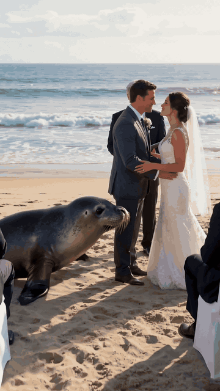
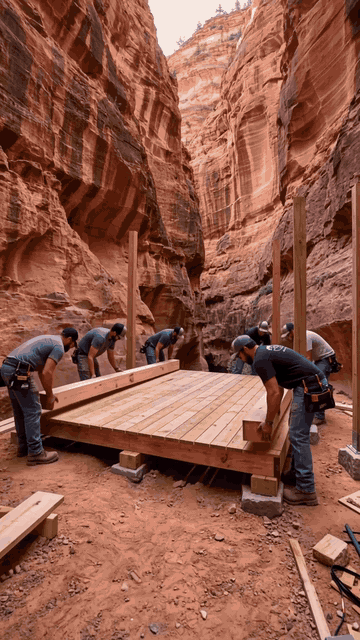

# PowerTokens Video Studio

**English** | [简体中文](README.zh-CN.md)

Windows desktop tool for batch & episodic AI video generation — Excel import, safe resume, no double charges.


PowerTokens Video Studio generates videos through the [PowerTokens](https://powertokens.ai/?utm_source=github&utm_medium=oss&utm_campaign=video-studio) API. It is built for people who generate many clips at once, such as short-drama episodes, and who need interrupted jobs to recover without paying twice.

### Supported models

| Display name | Model ID | Docs / pricing |
|---|---|---|
| Wan 3.0 (default) | `wan3.0-video` | [model page](https://powertokens.ai/models/wan3.0-video?utm_source=github&utm_medium=oss&utm_campaign=video-studio) · [API](https://docs.powertokens.ai/en/zmodelVideo/ali/wan3.0-video-generation?utm_source=github&utm_medium=oss&utm_campaign=video-studio) |
| Wan 3.0 Prime | `wan3.0-video-prime` | [model page](https://powertokens.ai/models/wan3.0-video-prime?utm_source=github&utm_medium=oss&utm_campaign=video-studio) · [API](https://docs.powertokens.ai/en/zmodelVideo/ali/wan3.0-video-generation?utm_source=github&utm_medium=oss&utm_campaign=video-studio) |
| Seedance 2.0 Fast | `dreamina-seedance-2-0-fast-260128` | [model page](https://powertokens.ai/models/dreamina-seedance-2-0-fast-260128?utm_source=github&utm_medium=oss&utm_campaign=video-studio) · [API](https://docs.powertokens.ai/en/zmodelVideo/byteplus/dreamina-seedance-2-0-fast-text-to-video?utm_source=github&utm_medium=oss&utm_campaign=video-studio) |
| Seedance 2.5 | `dreamina-seedance-2-5-260628` | [model page](https://powertokens.ai/models/dreamina-seedance-2-5-260628?utm_source=github&utm_medium=oss&utm_campaign=video-studio) · [API](https://docs.powertokens.ai/en/zmodelVideo/byteplus/dreamina-seedance-2-5-text-to-video?utm_source=github&utm_medium=oss&utm_campaign=video-studio) |
| kling v3 | `kling-v3` | [model page](https://powertokens.ai/models/kling-v3?utm_source=github&utm_medium=oss&utm_campaign=video-studio) · [API](https://docs.powertokens.ai/en/zmodelVideo/kling/kling-v3-text2video?utm_source=github&utm_medium=oss&utm_campaign=video-studio) |

Pick a model in the desktop UI, pass `--model` on the CLI, set `model` on MCP tools, or add an optional `Model` column in batch spreadsheets. Allowed durations, resolutions and aspect ratios depend on the model; invalid combinations are rejected before anything is submitted.

## Features

- **English and Chinese interface**: switch any time with the **中文 / English** toggle in the top-right corner. On first launch the app follows your Windows display language.
- **Use cases:** short-drama batch production remains a headline use case; also product demos, talking-head clips and social posts.
- **From script** (Batch tab only): paste a script/outline; free text model `glm-4.7-flash` (or `qwen3-max`) splits it into clip prompts for the preview table.
- **Compare models**: send one prompt to 2–3 models (Compare tab, CLI `compare`, or MCP `compare_videos`), see side-by-side status and open the best file. Outputs land in a `compare/` subfolder as `name_model-short.mp4`.
- **Model picker**: choose Wan 3.0 (default), Wan 3.0 Prime, Seedance 2.0 Fast, Seedance 2.5 or kling v3. Duration / resolution / ratio controls update to what that model allows.
- **Single video**: prompt, duration, resolution and ratio (limits depend on the model), optional first/last frame and reference image / video / audio URLs, seed (where supported). Duration and ratio are detected from the prompt in English or Chinese. Native audio is on when the model supports it.
- **Batch from Excel / CSV**: one row per clip, English or Chinese column headers, optional `Model` column (blank = Wan 3.0). Old templates with only a `Prompt` or legacy `Wan 3.0 Prompt` column keep working. Bounded concurrency (1–8 generations, 1–4 downloads), per-row status colors and CSV export of results.
- **Shared character settings for episodic series**: one cast description is added in front of every episode prompt, so characters stay consistent across rows.
- **Resume by Task ID**: every Task ID is saved before polling. Resuming only queries and downloads; it never resubmits.
- **Resumable downloads**: `.part` files with HTTP Range, overlap and size checks.
- **Key pool**: add several keys; batch rows rotate the preferred key.
- **No double charging**: a new key is tried only when a submission is explicitly rejected before any Task ID exists. Timeouts, 5xx and unclear responses are never retried automatically.
- **Encrypted key storage**: keys stay in memory by default, or are saved with Windows DPAPI (bound to your Windows account).
- Optional CLI (`pt_wan.py`) and MCP server (`mcp_server.py`).

## Screenshots

| Generate video | Batch import | API Key |
|---|---|---|
|  |  |  |

Prefer Chinese? Click **中文** in the top-right corner. The switch applies instantly and is remembered.

## Showcase

All clips below were generated with Wan 3.0 through this tool, unedited except for cropping and conversion to GIF. Expand a prompt to see exactly what was submitted.

<table>
<tr>
<td align="center" valign="top"><br><sub><b>Seal crashes a seaside wedding</b></sub></td>
<td align="center" valign="top"><br><sub><b>Golden retriever puppy grocery run</b></sub></td>
<td align="center" valign="top"><br><sub><b>A backyard inside a canyon</b></sub></td>
</tr>
<tr>
<td colspan="3" align="center" valign="top"><br><sub><b>Locker-room corridor dialogue (English lines, lip-sync)</b></sub></td>
</tr>
</table>

<details>
<summary>Prompt: Seal crashes a seaside wedding</summary>

```text
生成一段10秒、9:16竖屏、1080P、24fps的超写实短视频。整体必须像真实手机或现场设备拍到的偶发事件，不要广告片感，不要3D动画感，不要卡通质感。使用自然光、真实材质、自然运动模糊、轻微手持抖动、自动曝光变化、偶尔对焦搜索和真实环境噪音。画面模拟1990年代末到2000年代初家庭DV/VHS：低分辨率、CCD噪点、轻微隔行扫描、过曝高光、自动白平衡漂移、明显手抖。节奏：0-2秒必须立刻出现最反常画面形成钩子；2-7秒让核心行为持续升级；7-10秒完成反转或围观者反应，结尾不要淡出。 主体与事件：低清海边婚礼录像，一只海豹爬到第一排。结尾爆点：新人亲吻时它用鳍连续拍打像在鼓掌。人物和动物动作必须符合真实物理规律，比例、阴影、接触关系、重力、毛发/皮肤/衣物运动都要可信。避免字幕、避免水印、避免品牌Logo。
```

</details>

<details>
<summary>Prompt: Golden retriever puppy grocery run</summary>

```text
Subject: fluffy 6 month golden retriever puppy, tiny plain blue work apron, mini plastic kids shopping cart
Action: walking steadily pushing cart, suddenly freeze, sniff hard repeatedly, press wet nose on frosted glass, clear drool drip slowly down chin, flatten ears back, paw reach quietly for freezer handle
Environment: bright wide american warehouse supermarket aisle, stacked solid yellow cheese blocks inside glass freezer, blurred grocery shelves in background
Camera: eye level with puppy, vertical frame, close tracking shot
Motion: smooth follow movement, slow to complete stop when puppy freezes, hold static close up on drooling face for 3 seconds
Lighting: soft even overhead supermarket fluorescent, warm gentle highlight on cheese blocks
Texture: fluffy thick dog fur, frosted cold freezer glass, matte plastic cart, glossy drool
Emotion: serious dutiful at first, then overwhelmed hungry craving, silly adorable embarrassment
Style: cinematic warm realistic tiktok style, natural lighting, soft focus background
Avoid: no text, no watermark, no logos, no brand names, no UI screenshots, no human faces
Story: 系迷你员工围裙的小金毛正经推着儿童购物车沿货架巡走 → 路过冷柜时突然急刹停住，鼻头疯狂抽动嗅空气 → 扒住冷柜玻璃盯着码齐的芝士块，透明口水顺着下巴慢慢拉长滴落 → 耳朵唰地贴平脑袋，肉垫爪子偷偷伸向冷柜门把手
Audio: 温柔憋笑的青年女声，前半段压着平稳语气，看见口水时破功发出轻轻噗嗤笑，背景混超市滚轮声、隐约广播白噪音，配轻快软萌钢琴小旋律
```

</details>

<details>
<summary>Prompt: A backyard inside a canyon</summary>

```text
10-second vertical photorealistic cinematic construction timelapse. A narrow canyon surrounded by towering red rock walls is transformed into a hidden backyard retreat. Real builders carry timber through the canyon, construct a raised deck, pergola, small plunge pool, stone fire pit and outdoor seating between the cliffs. Water fills the pool as sunset illuminates the canyon walls. Final shot: the builder sits beside the pool while warm light reflects off the red rocks. Sound design: timber impacts, drilling, stone placement, water pouring, fire crackling and canyon wind. No narration, no music. Final text: "Would you build a backyard inside a canyon?"
```

</details>

<details>
<summary>Prompt: Locker-room corridor dialogue (English lines, lip-sync)</summary>

```text
Cinematic 16:9 photorealistic American youth-drama scene, approximately 16 seconds long.

SETTING
Public athletic center corridor outside the locker rooms: cool fluorescent lights, painted concrete walls, metal lockers in soft background blur, wooden bench, scuffed floor, distant gym echo. Dry air, no steam, no shower. Daytime interior.

CHARACTERS
@male_lead: early 20s, handsome, damp hair freshly towel-dried, dark hoodie, sweatpants, towel over one shoulder, natural skin texture, photoreal face.
@female_lead: early 20s, casual jacket, fitted top, full-length pants, natural skin and hair, still faintly self-conscious but composed.

0-4 SECONDS
@female_lead waits by the lockers, arms loosely crossed. Footsteps approach. @male_lead enters frame from the locker-room door, stopping a polite distance away. Eye-level medium two-shot.
@female_lead (English, lip-synced, controlled): "Who's in the bet. Names."
@male_lead hesitates, jaw tight, eyes flicking away then back.

4-9 SECONDS
Preserve screen direction. Subtle handheld. Shallow depth of field.
@male_lead: "Kade. Miles. Jace. And… Tyler."
At "Tyler," @female_lead's eyes harden; she blinks once, absorbing the insult of being wagered on.
Background stays hallway lockers—no bathroom fixtures.

9-13 SECONDS
@female_lead (flat, quiet resolve): "Saturday. Midnight. They don't get a kiss."
@male_lead: "What do they get."
@female_lead's mouth almost curves—not a smile of joy, a plan: "A story. The one where their bet dies in public."

13-16 SECONDS
She walks past him down the corridor. Camera tracks her briefly, then pans to @male_lead turning after her, concerned, following at a half-step. No kiss. No shower. No intimate framing.

AUDIO & STYLE
Stabilized handheld, natural motion blur, shallow DOF. Clear English dialogue lip-synced. No music—only hallway ambience, distant gym thud, footsteps. Photoreal youth drama. No text, no watermark, no logos, no beauty filter, no CGI look.
```

</details>

## Quick start (no Python needed)

1. Download `PowerTokensVideoStudio.exe` from the [Releases](../../releases/latest) page.
2. Double-click it. The EXE is not code-signed, so Windows SmartScreen may show "Windows protected your PC". Click **More info → Run anyway**.
3. Open the **API Key** tab, paste your PowerTokens key and click **Add to key pool**.
4. Write a prompt on the **Generate video** tab, or import a spreadsheet on the **Batch import** tab.

A three-episode sample spreadsheet is included in short-drama (`short-drama-batch-template.xlsx` / `短剧批量示例模板.xlsx`) and product (`product-batch-template.xlsx` / `产品批量示例模板.xlsx`). In the app, **Save short-drama sample…** / **Save product sample…** on the Batch import tab. Columns: `Title`, `Duration (s)`, `Resolution`, `Aspect ratio`, `Prompt` (only the prompt column is required; legacy `Wan 3.0 Prompt` still works). An optional `Model` column accepts a model ID or display name.

### CLI

```bash
python pt_wan.py estimate -d 5 -r 720p --model wan3.0-video
python pt_wan.py generate -p "A cat runs across grass" -d 5 -r 720p --model dreamina-seedance-2-0-fast-260128 -o out.mp4
python pt_wan.py compare --models wan3.0-video,dreamina-seedance-2-5-260628,kling-v3 -p "A cat runs across grass" -d 5 -r 720p -o ./out
python pt_wan.py storyboard --script outline.txt --out rows.xlsx --duration 8 --text-model glm-4.7-flash
```

`--model` defaults to `wan3.0-video`. See `python pt_wan.py generate -h` for media options.

## Get an API key

Sign up on [PowerTokens](https://powertokens.ai/api-keys?utm_source=github&utm_medium=oss&utm_campaign=video-studio) and create a key. The **Sign up / Get an API key** button in the app opens the same page.

## Run from source

Requires Windows and Python 3.11+ (with Tcl/Tk and "Add python.exe to PATH"). No third-party packages are needed.

```bat
Start.bat
```

or `python app.py`.

## Use with AI assistants (MCP)

`mcp_server.py` is a small [MCP](https://modelcontextprotocol.io) server that lets AI assistants such as Claude Desktop and Cursor create videos for you. It uses the same engine as the desktop app (through `pt_wan.py`), so every Task ID (and its model) is saved and interrupted jobs are resumed instead of resubmitted. The assistant gets these tools:

| Tool | What it does |
|---|---|
| `check_key` | Shows how many API keys are configured (masked) and whether the server is ready. It does not contact the API. |
| `estimate_cost` | Estimates the cost for `duration_s`, `resolution` and optional `model` (default `wan3.0-video`). |
| `generate_video` | Submits a `prompt` with optional `duration_s`, `resolution`, `model` and `output` path, waits for the result (up to an hour) and downloads the MP4. |
| `resume_video` | Checks and downloads an existing task by `task_id` to `output` with its original key (`key_index`, 1-based, default 1). Nothing new is submitted. |

Tool descriptions and messages follow the app's language setting (English or Chinese).

**Requirements.** Run it from the source folder with Python 3.11+ (the EXE does not include the MCP server) and install the MCP Python SDK (1.x and 2.x both work):

```bash
pip install mcp
```

**API key.** The MCP server needs a PowerTokens API key ([create one here](https://powertokens.ai/api-keys?utm_source=github&utm_medium=oss&utm_campaign=video-studio)). Pass it through the `POWERTOKENS_API_KEY` environment variable, or `POWERTOKENS_API_KEYS` for a comma-separated key pool. If neither is set, the server uses the keys saved with `python pt_wan.py config --add-key`. Keys saved in the desktop app are not shared with the MCP server.

**Configure your assistant.** Add the server to Claude Desktop (`claude_desktop_config.json`) or Cursor (`~/.cursor/mcp.json`, or `.cursor/mcp.json` in a project):

```json
{
  "mcpServers": {
    "powertokens-video-studio": {
      "command": "python",
      "args": ["C:\\path\\to\\video-studio\\mcp_server.py"],
      "env": {
        "POWERTOKENS_API_KEY": "your-powertokens-api-key"
      }
    }
  }
}
```

Use the full path to `mcp_server.py` in your copy of this repository, and the full path to `python.exe` (or your virtualenv's Python) if `python` is not on PATH. On macOS or Linux, use `python3` and a path such as `/Users/you/video-studio/mcp_server.py`. Restart the assistant after editing the config. The key is stored in that config file, so keep it private.

**Docker.** The repository also has a `Dockerfile` that runs only the MCP server over stdio (no desktop app):

```bash
docker build -t powertokens-video-studio-mcp .
docker run -i --rm -e POWERTOKENS_API_KEY=your-powertokens-api-key -v "$PWD/videos:/videos" powertokens-video-studio-mcp
```

In an assistant config, use `"command": "docker"` with those `run` arguments (keep `-i`). Videos are saved in `/videos` inside the container, so mount a folder there and ask for output paths such as `/videos/scene1.mp4`. The server starts and lists its tools without a key; `check_key` then reports that no key is configured.

Tips:

- Ask for an absolute `output` path such as `C:\Videos\scene1.mp4`. Without one, the video is saved as `wan_<id>.mp4` in the server's working directory.
- If a generation is interrupted or times out, ask the assistant to call `resume_video` with the Task ID instead of generating again, so the task is only charged once.

## Build the EXE

On Windows, run `Build-EXE.bat`. It creates a build virtualenv, installs PyInstaller, runs the tests and writes `dist\PowerTokensVideoStudio.exe`, with the PowerTokens icon and the `assets` folder bundled.

The GitHub Actions workflow **Build Windows executable** (`.github/workflows/build-windows.yml`) builds the same EXE when you push a `v*` tag or start it manually.

## Pricing

Costs are charged by PowerTokens and depend on the model, duration and resolution. The app shows an estimate based on published rates checked on the date it displays; your PowerTokens bill is authoritative. See each model page linked [above](#supported-models) for current pricing.

## Security notes

- The API key is only sent to the configured API host (`https://api.powertokens.ai` by default). It is stripped from redirects and never sent to CDN / storage hosts.
- Task records store a key fingerprint (first 16 hex characters of SHA-256) and the last 4 characters, never the full key.
- Desktop keys are kept in memory unless you tick "remember"; then they are encrypted with Windows DPAPI.
- **The CLI config stores keys in plain text.** `python pt_wan.py config --add-key` writes the key unencrypted to `%LOCALAPPDATA%\PowerTokensWan\cli-config.json` (or the `PT_WAN_CONFIG` path), and file permissions cannot be restricted on Windows. Prefer the `POWERTOKENS_API_KEY` / `POWERTOKENS_API_KEYS` environment variables, and never commit that file.
- Signed video download links are stored in the local task record until the download completes, then cleared. If a download never completes they remain there; they expire on their own.
- To use another HTTPS gateway, set `POWERTOKENS_API_BASE` (HTTPS only).

Local data lives in `%LOCALAPPDATA%\PowerTokensWan` (the folder name is kept from earlier versions so existing records keep working).

## Troubleshooting

**The status query returns HTTP 403.**
The app keeps using the key that submitted the task and also tries the task's download endpoint. In a batch, the row is set aside and queried once more with the original key after the other rows finish. Keys are never deleted because of a 403. If it persists, check the task in the PowerTokens dashboard, then resume it later from the task history.

**Generation timed out.**
The app waits up to one hour per task, then tries one more download. The Task ID is kept either way. Open **History / Resume**, select the task and click **Resume selected**. Do not generate again, or you may pay twice.

**I clicked "Stop waiting". Is the task cancelled?**
No. Only the local wait stops; the task keeps running in the cloud and may be charged. Resume it from **History / Resume**.

**A batch row shows "Result unknown".**
The app could not confirm whether the task was created, so it will not resubmit. Look up the task in the PowerTokens dashboard and use **Link existing Task ID** on that row.

**How do I change the language?**
Click **中文** or **English** in the top-right corner. The window switches immediately and keeps your prompt, keys and imported batch; the choice is saved in `%LOCALAPPDATA%\PowerTokensWan\settings.json`.

More details are in the Chinese user guide: [使用说明.md](使用说明.md). Release notes: [CHANGELOG.md](CHANGELOG.md).

## FAQ

### Why do some files still say Wan?

Internal names such as `pt_wan.py` and the data folder `%LOCALAPPDATA%\PowerTokensWan` are kept for compatibility with existing installs, task records and saved keys. The product name is PowerTokens Video Studio.


### Can I limit how much each API key spends?

Yes. On the [API Keys](https://powertokens.ai/api-keys?utm_source=github&utm_medium=app&utm_campaign=video-studio) page you can set a usage limit and an expiry on each key. In this app, when one key in the pool hits its limit or expires, the next key is tried automatically. A submit that already returned a Task ID is never charged again.

### What is PowerTokens Video Studio?

PowerTokens Video Studio is a free, open-source (MIT) Windows desktop app for generating many AI videos at once through the PowerTokens API. It supports Wan 3.0 (default), Wan 3.0 Prime, Seedance 2.0 Fast, Seedance 2.5 and kling v3, with batch import from Excel / CSV, resume by Task ID and protection against double charges.

### Can I batch-generate videos from a spreadsheet?

Yes. On the **Batch import** tab, load an Excel or CSV file with one row per clip; only the `Prompt` column is required (legacy `Wan 3.0 Prompt` still works), and English or Chinese headers both work. An optional `Model` column picks the model per row (blank = Wan 3.0). Rows run with 1–8 concurrent generations, and you can export the results to CSV.

### How do I keep characters consistent across episodes of an AI short drama?

Fill in the shared character settings: one cast description is added in front of every episode prompt, so the same characters appear in every row. The included three-episode sample spreadsheet shows the format.

### If a generation is interrupted, will I be charged twice?

No, as long as you resume instead of generating again. Every Task ID (and its model) is saved before polling, and resuming only queries and downloads the existing task on the correct endpoint. A new key is tried only when a submission is explicitly rejected before any Task ID exists; timeouts and 5xx errors are never retried automatically.

### Can Claude Desktop, Cursor or other AI assistants generate videos with it?

Yes. `mcp_server.py` is an MCP server, also [listed on Glama](https://glama.ai/mcp/servers/PowerTokens/video-studio), that gives MCP-compatible assistants such as Claude Desktop and Cursor four tools: `check_key`, `estimate_cost`, `generate_video`, `resume_video`, `list_models` and `compare_videos`. Run it from source with Python 3.11+ and `pip install mcp`, or with the included `Dockerfile` (see [Use with AI assistants (MCP)](#use-with-ai-assistants-mcp)).

### Does it run on macOS or Linux?

The desktop app and the EXE are Windows only. The MCP server also runs on macOS and Linux with Python 3.11+, or in Docker on any system.

### How do I get a PowerTokens API key, and how are models billed?

Sign up on [PowerTokens](https://powertokens.ai/api-keys?utm_source=github&utm_medium=readme&utm_campaign=faq) and create a key; one key works for every model on the platform, and you can pay by credit card or PayPal ([quickstart](https://docs.powertokens.ai/en/guides/powertokens-quickstart?utm_source=github&utm_medium=readme&utm_campaign=faq)). Billing depends on the model — see the [supported models](#supported-models) links for current rates and API details.

## Development

```bash
python -m unittest discover -s tests -v
```

Tests use mocked responses and never call the real API. GUI tests run on Windows, or elsewhere with `PT_GUI_TESTS=1`.

## License and community

MIT, see [LICENSE](LICENSE).

**Trademark.** The MIT license covers the code only. The PowerTokens name and logo are trademarks of PowerTokens and are not licensed for use. If you fork or redistribute this project, please use a different name and logo, and don't imply it is an official PowerTokens product.

Questions and feedback: [Discord](https://discord.gg/JtgtRdhJVS) or [Issues](../../issues).

Contributing: see [CONTRIBUTING.md](CONTRIBUTING.md).

Created by [@uselesssoso](https://github.com/uselesssoso) for [PowerTokens](https://powertokens.ai).
