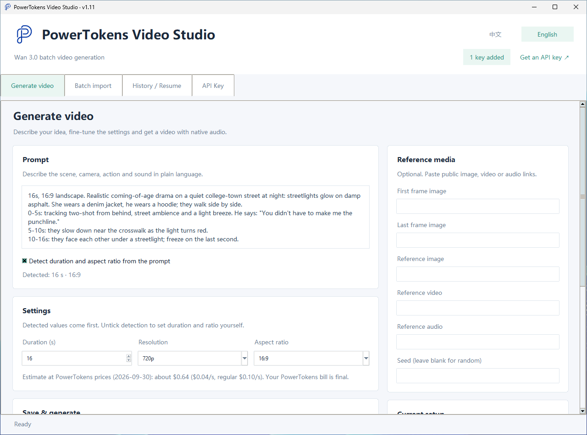
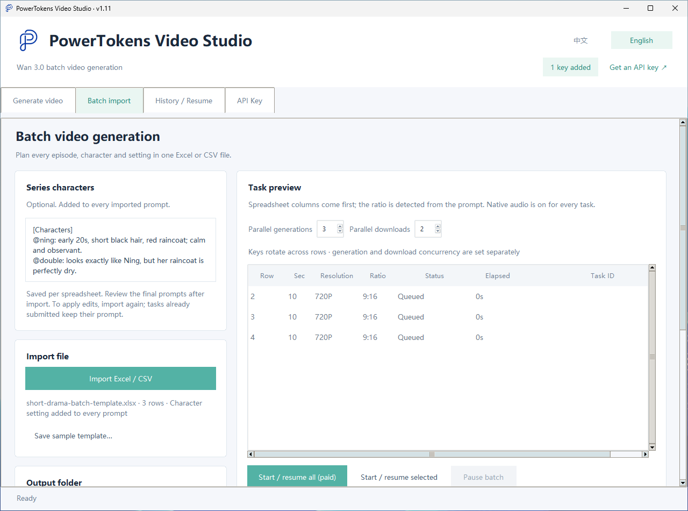
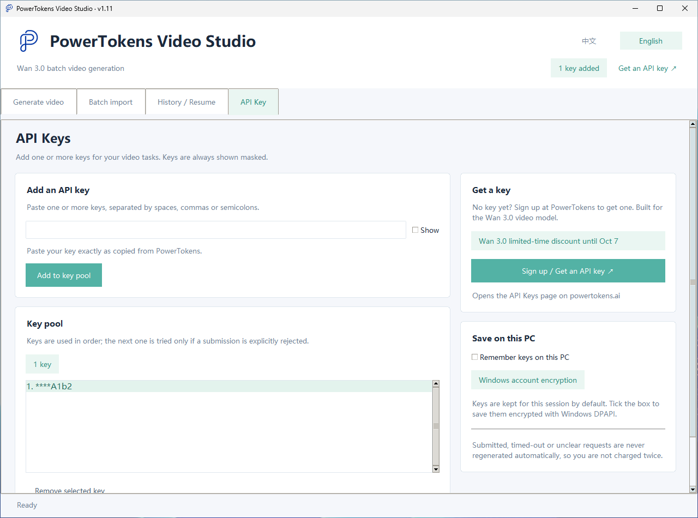

# PowerTokens Video Studio

**English** | [简体中文](README.zh-CN.md)

Windows desktop tool for batch & episodic AI video generation with Wan 3.0 — Excel import, safe resume, no double charges.

<!-- promo:start (remove this block when the campaign ends) -->
> **Wan 3.0 limited-time discount until Oct 7, 2026.** See current prices on the [Wan 3.0 model page](https://powertokens.ai/models/wan3.0-video?utm_source=github&utm_medium=oss&utm_campaign=video-studio).
<!-- promo:end -->


PowerTokens Video Studio calls the Wan 3.0 video model (`wan3.0-video`) through the [PowerTokens](https://powertokens.ai/?utm_source=github&utm_medium=oss&utm_campaign=video-studio) API. It is built for people who generate many clips at once, such as short-drama episodes, and who need interrupted jobs to recover without paying twice.

**Currently supports the Wan 3.0 video model only.** Requests for more models are welcome in [Issues](../../issues).

## Features

- **English and Chinese interface**: switch any time with the **中文 / English** toggle in the top-right corner. On first launch the app follows your Windows display language.
- **Single video**: prompt, duration (2–30 s), 720p / 1080p, 16:9 / 9:16 / 1:1, optional first/last frame and reference image / video / audio URLs, seed. Duration and ratio are detected from the prompt in English or Chinese: "16s, 16:9 landscape…", "total length 15s", or a shot timeline such as "0-3s … 8-12s" or "00:00-00:03 …". Native audio is on.
- **Batch from Excel / CSV**: one row per clip, English or Chinese column headers, bounded concurrency (1–8 generations, 1–4 downloads), per-row status colors and CSV export of results.
- **Shared character settings for episodic series**: one cast description is added in front of every episode prompt, so characters stay consistent across rows.
- **Resume by Task ID**: every Task ID is saved before polling. Resuming only queries and downloads; it never resubmits.
- **Resumable downloads**: `.part` files with HTTP Range, overlap and size checks.
- **Key pool**: add several keys; batch rows rotate the preferred key.
- **No double charging**: a new key is tried only when a submission is explicitly rejected before any Task ID exists. Timeouts, 5xx and unclear responses are never retried automatically.
- **Encrypted key storage**: keys stay in memory by default, or are saved with Windows DPAPI (bound to your Windows account).
- Optional CLI (`pt_wan.py`) and MCP server (`mcp_server.py`).

## Screenshots

| Generate video | Batch import | API Key |
|---|---|---|
|  |  |  |

Prefer Chinese? Click **中文** in the top-right corner. The switch applies instantly and is remembered.

## Quick start (no Python needed)

1. Download `PowerTokensVideoStudio.exe` from the [Releases](../../releases/latest) page.
2. Double-click it. The EXE is not code-signed, so Windows SmartScreen may show "Windows protected your PC". Click **More info → Run anyway**.
3. Open the **API Key** tab, paste your PowerTokens key and click **Add to key pool**.
4. Write a prompt on the **Generate video** tab, or import a spreadsheet on the **Batch import** tab.

A three-episode sample spreadsheet is included in English (`short-drama-batch-template.xlsx`) and Chinese (`短剧批量示例模板.xlsx`). In the app, **Save sample template…** on the Batch import tab saves the one that matches your interface language. Columns: `Title`, `Duration (s)`, `Resolution`, `Aspect ratio`, `Wan 3.0 Prompt` (only the prompt column is required).

## Get an API key

Sign up on [PowerTokens](https://powertokens.ai/api-keys?utm_source=github&utm_medium=oss&utm_campaign=video-studio) and create a key. The **Sign up / Get an API key** button in the app opens the same page.

## Run from source

Requires Windows and Python 3.11+ (with Tcl/Tk and "Add python.exe to PATH"). No third-party packages are needed.

```bat
Start.bat
```

or `python app.py`.

## Use with AI assistants (MCP)

`mcp_server.py` is a small [MCP](https://modelcontextprotocol.io) server that lets AI assistants such as Claude Desktop and Cursor create Wan 3.0 videos for you. It uses the same engine as the desktop app (through `pt_wan.py`), so every Task ID is saved and interrupted jobs are resumed instead of resubmitted. The assistant gets four tools:

| Tool | What it does |
|---|---|
| `check_key` | Shows how many API keys are configured (masked) and whether the server is ready. It does not contact the API. |
| `estimate_cost` | Estimates the cost for `duration_s` (2–30, default 5) and `resolution` (`720p` or `1080p`, default `720p`). |
| `generate_video` | Submits a `prompt` with optional `duration_s`, `resolution` and `output` path, waits for the result (up to an hour) and downloads the MP4. |
| `resume_video` | Checks and downloads an existing task by `task_id` to `output` with its original key (`key_index`, 1-based, default 1). Nothing new is submitted. |

Tool descriptions and messages follow the app's language setting (English or Chinese).

**Requirements.** Run it from the source folder with Python 3.11+ (the EXE does not include the MCP server) and install the MCP Python SDK (1.x and 2.x both work):

```bash
pip install mcp
```

**API key.** The MCP server needs a PowerTokens API key ([create one here](https://powertokens.ai/api-keys?utm_source=github&utm_medium=oss&utm_campaign=video-studio)). Pass it through the `POWERTOKENS_API_KEY` environment variable, or `POWERTOKENS_API_KEYS` for a comma-separated key pool. If neither is set, the server uses the keys saved with `python pt_wan.py config --add-key`. Keys saved in the desktop app are not shared with the MCP server.

**Configure your assistant.** Add the server to Claude Desktop (`claude_desktop_config.json`) or Cursor (`~/.cursor/mcp.json`, or `.cursor/mcp.json` in a project):

```json
{
  "mcpServers": {
    "powertokens-video-studio": {
      "command": "python",
      "args": ["C:\\path\\to\\video-studio\\mcp_server.py"],
      "env": {
        "POWERTOKENS_API_KEY": "your-powertokens-api-key"
      }
    }
  }
}
```

Use the full path to `mcp_server.py` in your copy of this repository, and the full path to `python.exe` (or your virtualenv's Python) if `python` is not on PATH. On macOS or Linux, use `python3` and a path such as `/Users/you/video-studio/mcp_server.py`. Restart the assistant after editing the config. The key is stored in that config file, so keep it private.

Tips:

- Ask for an absolute `output` path such as `C:\Videos\scene1.mp4`. Without one, the video is saved as `wan_<id>.mp4` in the server's working directory.
- If a generation is interrupted or times out, ask the assistant to call `resume_video` with the Task ID instead of generating again, so the task is only charged once.

## Build the EXE

On Windows, run `Build-EXE.bat`. It creates a build virtualenv, installs PyInstaller, runs the tests and writes `dist\PowerTokensVideoStudio.exe`, with the PowerTokens icon and the `assets` folder bundled.

The GitHub Actions workflow **Build Windows executable** (`.github/workflows/build-windows.yml`) builds the same EXE when you push a `v*` tag or start it manually.

## Pricing

Costs are charged by PowerTokens per second of video and depend on resolution. The app shows an estimate based on the price checked on the date it displays; your PowerTokens bill is authoritative. The discounted rate is used through Oct 7, 2026 (local date), with the regular price shown alongside; from Oct 8 the estimate switches to the regular price automatically. Check current prices on [PT's Wan 3.0 pricing page](https://powertokens.ai/models/wan3.0-video?utm_source=github&utm_medium=oss&utm_campaign=video-studio).

## Security notes

- The API key is only sent to the configured API host (`https://api.powertokens.ai` by default). It is stripped from redirects and never sent to CDN / storage hosts.
- Task records store a key fingerprint (first 16 hex characters of SHA-256) and the last 4 characters, never the full key.
- Desktop keys are kept in memory unless you tick "remember"; then they are encrypted with Windows DPAPI.
- **The CLI config stores keys in plain text.** `python pt_wan.py config --add-key` writes the key unencrypted to `%LOCALAPPDATA%\PowerTokensWan\cli-config.json` (or the `PT_WAN_CONFIG` path), and file permissions cannot be restricted on Windows. Prefer the `POWERTOKENS_API_KEY` / `POWERTOKENS_API_KEYS` environment variables, and never commit that file.
- Signed video download links are stored in the local task record until the download completes, then cleared. If a download never completes they remain there; they expire on their own.
- To use another HTTPS gateway, set `POWERTOKENS_API_BASE` (HTTPS only).

Local data lives in `%LOCALAPPDATA%\PowerTokensWan` (the folder name is kept from earlier versions so existing records keep working).

## FAQ

**The status query returns HTTP 403.**
The app keeps using the key that submitted the task and also tries the task's download endpoint. In a batch, the row is set aside and queried once more with the original key after the other rows finish. Keys are never deleted because of a 403. If it persists, check the task in the PowerTokens dashboard, then resume it later from the task history.

**Generation timed out.**
The app waits up to one hour per task, then tries one more download. The Task ID is kept either way. Open **History / Resume**, select the task and click **Resume selected**. Do not generate again, or you may pay twice.

**I clicked "Stop waiting". Is the task cancelled?**
No. Only the local wait stops; the task keeps running in the cloud and may be charged. Resume it from **History / Resume**.

**A batch row shows "Result unknown".**
The app could not confirm whether the task was created, so it will not resubmit. Look up the task in the PowerTokens dashboard and use **Link existing Task ID** on that row.

**How do I change the language?**
Click **中文** or **English** in the top-right corner. The window switches immediately and keeps your prompt, keys and imported batch; the choice is saved in `%LOCALAPPDATA%\PowerTokensWan\settings.json`.

More details are in the Chinese user guide: [使用说明.md](使用说明.md). Release notes: [CHANGELOG.md](CHANGELOG.md).

## Development

```bash
python -m unittest discover -s tests -v
```

Tests use mocked responses and never call the real API. GUI tests run on Windows, or elsewhere with `PT_GUI_TESTS=1`.

## License and community

MIT, see [LICENSE](LICENSE).

Questions and feedback: [Discord](https://discord.gg/JtgtRdhJVS) or [Issues](../../issues).
