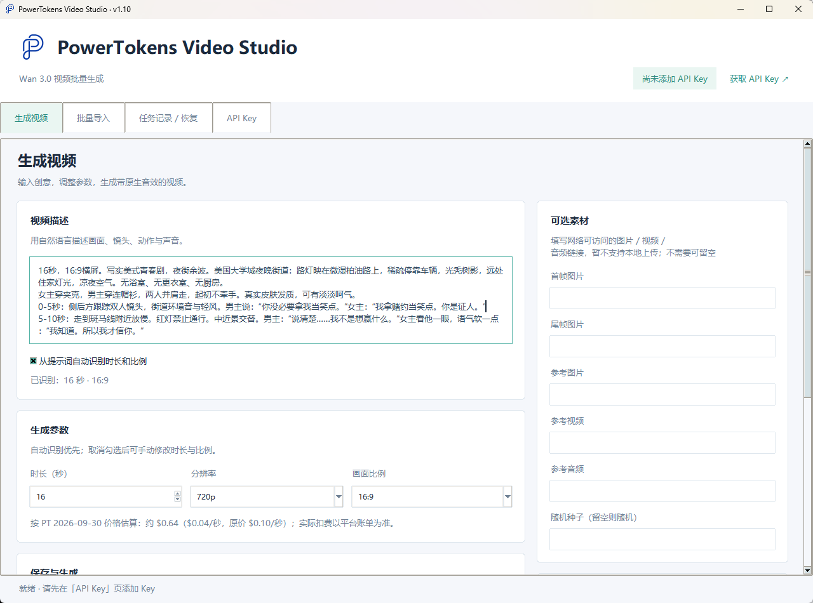
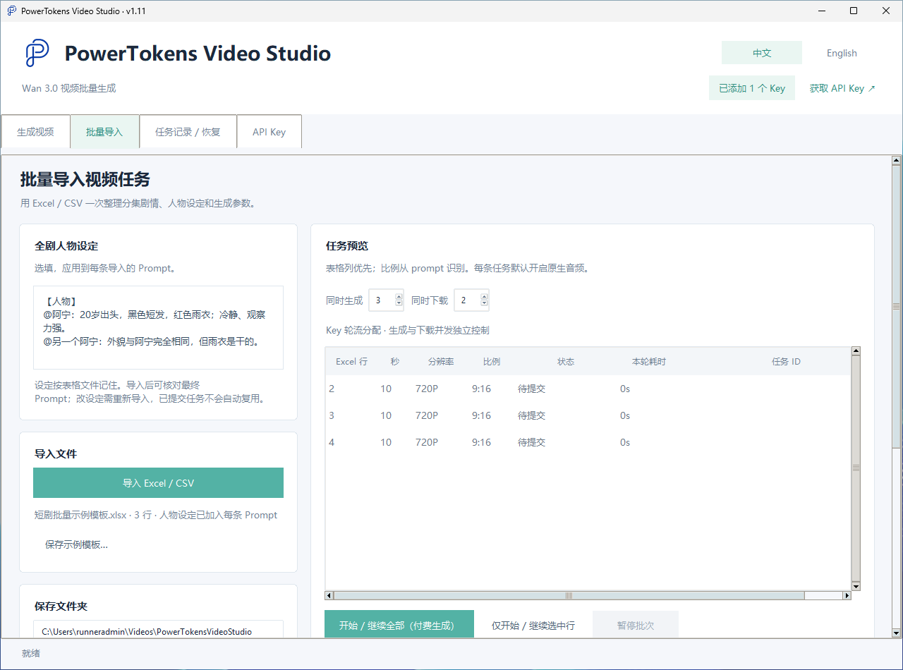
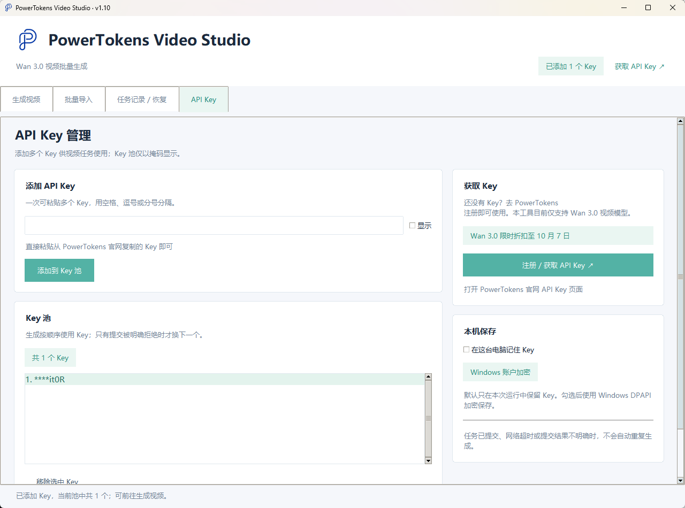

# PowerTokens Video Studio

[English](README.md) | **简体中文**

基于 Wan 3.0 的 Windows 批量 / 连续剧集 AI 视频生成工具：Excel 导入、安全恢复、不重复扣费。

<!-- promo:start （活动结束后删除此段） -->
> **Wan 3.0 限时折扣至 2026 年 10 月 7 日。** 当前价格见 [Wan 3.0 模型页](https://powertokens.ai/zh-Hans/models/wan3.0-video?utm_source=github&utm_medium=oss&utm_campaign=video-studio)。
<!-- promo:end -->


PowerTokens Video Studio 通过 [PowerTokens](https://powertokens.ai/zh-Hans?utm_source=github&utm_medium=oss&utm_campaign=video-studio) API 调用 Wan 3.0 视频模型（`wan3.0-video`），适合需要一次生成大量片段（例如短剧分集），并希望中断后能恢复、不重复付费的用户。

**目前仅支持 Wan 3.0 视频模型。** 需要其他模型，欢迎在 [Issues](../../issues) 中提出。

## 功能

- **支持中英文界面切换**：右上角「中文 / English」一键切换，立即生效并自动记住；首次启动跟随 Windows 显示语言。
- **单条生成**：提示词、时长（2–30 秒）、720p / 1080p、16:9 / 9:16 / 1:1，可选首帧、尾帧及参考图片 / 视频 / 音频链接和随机种子；可从中英文提示词识别时长与比例（如“16秒，16:9横屏…”、分镜时间轴“0-5秒…10-16秒”或英文 “total length 15s”、“00:00-00:03”）；默认开启原生音频。
- **Excel / CSV 批量生成**：一行一条，支持中英文表头，限定并发（生成 1–8、下载 1–4），按状态显示行颜色，可导出结果 CSV。
- **连续剧集的全剧人物设定**：一段人物设定自动加在每集 Prompt 前，保持人物一致。
- **按任务 ID 恢复**：轮询前先保存任务 ID；恢复只查询和下载，不会重新提交。
- **断点续传下载**：`.part` 临时文件，HTTP Range，并校验交界内容和文件大小。
- **Key 池**：可添加多个 Key，批量时按行轮换首选 Key。
- **不重复扣费**：只有在尚未获得任务 ID 且提交被明确拒绝时才换 Key；超时、5xx、结果不明确时都不会自动重试。
- **Key 加密保存**：默认只在内存中；勾选记住后使用 Windows DPAPI 加密，绑定当前 Windows 账户。
- 可选命令行（`pt_wan.py`）和 MCP 服务（`mcp_server.py`）。

## 界面预览

| 生成视频 | 批量导入 | API Key |
|---|---|---|
|  |  |  |

## 效果展示

以下片段均由本工具调用 Wan 3.0 生成，除裁剪并转为 GIF 外未做任何剪辑。点击展开可查看对应的完整提示词。

<table>
<tr>
<td align="center" valign="top"><br><sub><b>海边婚礼上的海豹</b></sub></td>
<td align="center" valign="top"><br><sub><b>金毛逛超市</b></sub></td>
<td align="center" valign="top"><br><sub><b>峡谷里的后院</b></sub></td>
</tr>
<tr>
<td colspan="3" align="center" valign="top"><br><sub><b>更衣室走廊对白（英文台词、口型同步）</b></sub></td>
</tr>
</table>

<details>
<summary>提示词：海边婚礼上的海豹</summary>

```text
生成一段10秒、9:16竖屏、1080P、24fps的超写实短视频。整体必须像真实手机或现场设备拍到的偶发事件，不要广告片感，不要3D动画感，不要卡通质感。使用自然光、真实材质、自然运动模糊、轻微手持抖动、自动曝光变化、偶尔对焦搜索和真实环境噪音。画面模拟1990年代末到2000年代初家庭DV/VHS：低分辨率、CCD噪点、轻微隔行扫描、过曝高光、自动白平衡漂移、明显手抖。节奏：0-2秒必须立刻出现最反常画面形成钩子；2-7秒让核心行为持续升级；7-10秒完成反转或围观者反应，结尾不要淡出。 主体与事件：低清海边婚礼录像，一只海豹爬到第一排。结尾爆点：新人亲吻时它用鳍连续拍打像在鼓掌。人物和动物动作必须符合真实物理规律，比例、阴影、接触关系、重力、毛发/皮肤/衣物运动都要可信。避免字幕、避免水印、避免品牌Logo。
```

</details>

<details>
<summary>提示词：金毛逛超市</summary>

```text
Subject: fluffy 6 month golden retriever puppy, tiny plain blue work apron, mini plastic kids shopping cart
Action: walking steadily pushing cart, suddenly freeze, sniff hard repeatedly, press wet nose on frosted glass, clear drool drip slowly down chin, flatten ears back, paw reach quietly for freezer handle
Environment: bright wide american warehouse supermarket aisle, stacked solid yellow cheese blocks inside glass freezer, blurred grocery shelves in background
Camera: eye level with puppy, vertical frame, close tracking shot
Motion: smooth follow movement, slow to complete stop when puppy freezes, hold static close up on drooling face for 3 seconds
Lighting: soft even overhead supermarket fluorescent, warm gentle highlight on cheese blocks
Texture: fluffy thick dog fur, frosted cold freezer glass, matte plastic cart, glossy drool
Emotion: serious dutiful at first, then overwhelmed hungry craving, silly adorable embarrassment
Style: cinematic warm realistic tiktok style, natural lighting, soft focus background
Avoid: no text, no watermark, no logos, no brand names, no UI screenshots, no human faces
Story: 系迷你员工围裙的小金毛正经推着儿童购物车沿货架巡走 → 路过冷柜时突然急刹停住，鼻头疯狂抽动嗅空气 → 扒住冷柜玻璃盯着码齐的芝士块，透明口水顺着下巴慢慢拉长滴落 → 耳朵唰地贴平脑袋，肉垫爪子偷偷伸向冷柜门把手
Audio: 温柔憋笑的青年女声，前半段压着平稳语气，看见口水时破功发出轻轻噗嗤笑，背景混超市滚轮声、隐约广播白噪音，配轻快软萌钢琴小旋律
```

</details>

<details>
<summary>提示词：峡谷里的后院</summary>

```text
10-second vertical photorealistic cinematic construction timelapse. A narrow canyon surrounded by towering red rock walls is transformed into a hidden backyard retreat. Real builders carry timber through the canyon, construct a raised deck, pergola, small plunge pool, stone fire pit and outdoor seating between the cliffs. Water fills the pool as sunset illuminates the canyon walls. Final shot: the builder sits beside the pool while warm light reflects off the red rocks. Sound design: timber impacts, drilling, stone placement, water pouring, fire crackling and canyon wind. No narration, no music. Final text: "Would you build a backyard inside a canyon?"
```

</details>

<details>
<summary>提示词：更衣室走廊对白（英文台词、口型同步）</summary>

```text
Cinematic 16:9 photorealistic American youth-drama scene, approximately 16 seconds long.

SETTING
Public athletic center corridor outside the locker rooms: cool fluorescent lights, painted concrete walls, metal lockers in soft background blur, wooden bench, scuffed floor, distant gym echo. Dry air, no steam, no shower. Daytime interior.

CHARACTERS
@male_lead: early 20s, handsome, damp hair freshly towel-dried, dark hoodie, sweatpants, towel over one shoulder, natural skin texture, photoreal face.
@female_lead: early 20s, casual jacket, fitted top, full-length pants, natural skin and hair, still faintly self-conscious but composed.

0-4 SECONDS
@female_lead waits by the lockers, arms loosely crossed. Footsteps approach. @male_lead enters frame from the locker-room door, stopping a polite distance away. Eye-level medium two-shot.
@female_lead (English, lip-synced, controlled): "Who's in the bet. Names."
@male_lead hesitates, jaw tight, eyes flicking away then back.

4-9 SECONDS
Preserve screen direction. Subtle handheld. Shallow depth of field.
@male_lead: "Kade. Miles. Jace. And… Tyler."
At "Tyler," @female_lead's eyes harden; she blinks once, absorbing the insult of being wagered on.
Background stays hallway lockers—no bathroom fixtures.

9-13 SECONDS
@female_lead (flat, quiet resolve): "Saturday. Midnight. They don't get a kiss."
@male_lead: "What do they get."
@female_lead's mouth almost curves—not a smile of joy, a plan: "A story. The one where their bet dies in public."

13-16 SECONDS
She walks past him down the corridor. Camera tracks her briefly, then pans to @male_lead turning after her, concerned, following at a half-step. No kiss. No shower. No intimate framing.

AUDIO & STYLE
Stabilized handheld, natural motion blur, shallow DOF. Clear English dialogue lip-synced. No music—only hallway ambience, distant gym thud, footsteps. Photoreal youth drama. No text, no watermark, no logos, no beauty filter, no CGI look.
```

</details>

## 快速开始（无需 Python）

1. 从 [Releases](../../releases/latest) 页面下载 `PowerTokensVideoStudio.exe`。
2. 双击运行。EXE 没有代码签名，Windows SmartScreen 可能提示“Windows 已保护你的电脑”，点击「更多信息」→「仍要运行」。
3. 在「API Key」页粘贴 PowerTokens Key，点击「添加到 Key 池」。
4. 在「生成视频」页填写提示词，或在「批量导入」页导入表格。

附带三集示例表格：`短剧批量示例模板.xlsx`（英文版为 `short-drama-batch-template.xlsx`）。在「批量导入」页点击「保存示例模板…」可保存与当前界面语言一致的模板。

## 获取 API Key

在 [PowerTokens](https://powertokens.ai/zh-Hans/api-keys?utm_source=github&utm_medium=oss&utm_campaign=video-studio) 注册并创建 Key。工具内的「注册 / 获取 API Key」按钮会打开同一页面。

## 从源码运行

需要 Windows 和 Python 3.11+（安装时保留 Tcl/Tk，并勾选 “Add python.exe to PATH”），无需第三方库。双击 `Start.bat`，或运行 `python app.py`。

## 在 AI 助手中使用（MCP）

`mcp_server.py` 是一个小型 [MCP](https://modelcontextprotocol.io) 服务，可让 Claude Desktop、Cursor 等 AI 助手直接为你生成 Wan 3.0 视频。它与桌面端使用同一套引擎（通过 `pt_wan.py` 调用），每个任务 ID 都会保存，中断后恢复原任务而不是重新提交。AI 助手可使用四个工具：

| 工具 | 作用 |
|---|---|
| `check_key` | 显示已配置的 API Key 数量（脱敏）以及服务是否就绪，不会访问接口。 |
| `estimate_cost` | 按 `duration_s`（2–30 秒，默认 5）和 `resolution`（`720p` 或 `1080p`，默认 `720p`）估算费用。 |
| `generate_video` | 提交 `prompt`，可选 `duration_s`、`resolution` 和 `output` 保存路径；等待结果（最长约 1 小时）并下载 MP4。 |
| `resume_video` | 按 `task_id` 用原 Key（`key_index`，从 1 开始，默认 1）查询并下载已有任务到 `output`，不提交新生成。 |

工具说明和返回信息跟随工具的界面语言设置（中文或英文）。

**环境要求：** 需在源码目录中用 Python 3.11+ 运行（EXE 不包含 MCP 服务），并安装 MCP Python SDK（1.x 和 2.x 均可）：

```bash
pip install mcp
```

**API Key：** MCP 服务需要 PowerTokens API Key（[在此创建](https://powertokens.ai/zh-Hans/api-keys?utm_source=github&utm_medium=oss&utm_campaign=video-studio)）。通过环境变量 `POWERTOKENS_API_KEY` 传入；多个 Key 可用 `POWERTOKENS_API_KEYS`，以英文逗号分隔。两者都未设置时，使用 `python pt_wan.py config --add-key` 保存的 Key。桌面端保存的 Key 不会共享给 MCP 服务。

**配置 AI 助手：** 在 Claude Desktop（`claude_desktop_config.json`）或 Cursor（`~/.cursor/mcp.json`，或项目内的 `.cursor/mcp.json`）中添加：

```json
{
  "mcpServers": {
    "powertokens-video-studio": {
      "command": "python",
      "args": ["C:\\path\\to\\video-studio\\mcp_server.py"],
      "env": {
        "POWERTOKENS_API_KEY": "your-powertokens-api-key"
      }
    }
  }
}
```

请填写本仓库副本中 `mcp_server.py` 的完整路径；如果 `python` 不在 PATH 中，请填写 `python.exe`（或虚拟环境中 Python）的完整路径。macOS / Linux 上使用 `python3` 和类似 `/Users/you/video-studio/mcp_server.py` 的路径。修改配置后重启 AI 助手。Key 会保存在该配置文件中，请妥善保管。

**Docker：** 仓库中的 `Dockerfile` 只运行 MCP 服务（stdio，不含桌面端）：

```bash
docker build -t powertokens-video-studio-mcp .
docker run -i --rm -e POWERTOKENS_API_KEY=你的-powertokens-api-key -v "$PWD/videos:/videos" powertokens-video-studio-mcp
```

在 AI 助手配置中使用 `"command": "docker"`，参数与上面的 `run` 相同（保留 `-i`）。视频保存在容器内的 `/videos`，请挂载一个文件夹到此处，并使用 `/videos/scene1.mp4` 这样的输出路径。未配置 Key 时服务也能启动并列出工具，`check_key` 会显示尚未配置 Key。

提示：

- 建议让助手使用绝对路径作为 `output`，例如 `C:\Videos\scene1.mp4`；未指定时，视频会以 `wan_<id>.mp4` 保存在服务的工作目录中。
- 如果生成中断或超时，请让助手用任务 ID 调用 `resume_video`，而不是重新生成，这样同一任务只计费一次。

## 构建 EXE

在 Windows 上运行 `Build-EXE.bat`：创建构建环境、安装 PyInstaller、运行测试，生成带 PowerTokens 图标、已打包 `assets` 目录的 `dist\PowerTokensVideoStudio.exe`。

GitHub Actions 工作流 **Build Windows executable**（`.github/workflows/build-windows.yml`）会在推送 `v*` 标签或手动触发时构建同一个 EXE。

## 费用

PowerTokens 按视频秒数计费，价格与分辨率有关。工具按界面上标注的检查日期时的价格估算，实际扣费以 PowerTokens 账单为准。2026 年 10 月 7 日（本机日期）及之前按折扣价估算并同时显示原价；10 月 8 日起自动改按原价估算。最新价格请查看 [PT 的 Wan 3.0 价格页](https://powertokens.ai/zh-Hans/models/wan3.0-video?utm_source=github&utm_medium=oss&utm_campaign=video-studio)。

## 安全说明

- API Key 只发送到配置的 API 主机（默认 `https://api.powertokens.ai`），跳转时会移除，不会发送到 CDN / 存储域名。
- 任务记录只保存 Key 指纹（SHA-256 前 16 位）和末 4 位，不保存完整 Key。
- 桌面端 Key 默认只在内存中；勾选记住后用 Windows DPAPI 加密保存。
- **CLI 配置以明文保存 Key。** `python pt_wan.py config --add-key` 会把 Key 不加密地写入 `%LOCALAPPDATA%\PowerTokensWan\cli-config.json`（或 `PT_WAN_CONFIG` 指定的路径），在 Windows 上无法限制文件权限。建议使用环境变量 `POWERTOKENS_API_KEY` / `POWERTOKENS_API_KEYS`，并且不要把该文件提交到版本库。
- 带签名的视频下载链接会保存在本机任务记录中，下载完成后清空；如果下载一直没有完成，链接会保留，但链接本身会过期。
- 如需通过其他 HTTPS 网关访问，可设置 `POWERTOKENS_API_BASE`（仅限 HTTPS）。

本机数据位于 `%LOCALAPPDATA%\PowerTokensWan`（沿用旧版目录名，已有记录可继续使用）。

## 常见问题

**状态查询返回 HTTP 403？**
工具会继续用提交该任务的原 Key 查询，并尝试任务的下载地址。批量时该行先暂缓，其余行处理完后再用原 Key 查询一次。工具不会因 403 删除 Key。若持续出现，请在 PowerTokens 控制台查看该任务，稍后从任务记录继续。

**生成超时？**
每个任务本地最多等待 1 小时，到时会再尝试一次下载；无论结果如何都会保留任务 ID。在「任务记录 / 恢复」页选中任务，点击「继续查询选中任务」即可。请不要直接重新生成，以免重复扣费。

**点了「停止等待」，任务取消了吗？**
没有。只是停止本机等待，任务仍在云端继续并可能计费，可在任务记录里找回。

**批量行显示「提交结果未知」？**
工具无法确认任务是否已创建，因此不会自动重新提交。请在 PowerTokens 控制台找到该任务 ID，选中该行后点击「关联已有任务 ID」。

完整说明见 [使用说明.md](使用说明.md)，版本历史见 [CHANGELOG.md](CHANGELOG.md)。

## 开发

```bash
python -m unittest discover -s tests -v
```

测试使用模拟响应，不会调用真实接口。界面测试在 Windows 上运行，其他系统可设置 `PT_GUI_TESTS=1`。

## 许可证与社区

MIT，见 [LICENSE](LICENSE)。

问题与反馈：[Discord](https://discord.gg/JtgtRdhJVS) 或 [Issues](../../issues)。

作者：[@uselesssoso](https://github.com/uselesssoso)，由 [PowerTokens](https://powertokens.ai) 出品。
